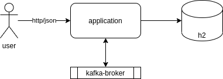

# Spring Cloud Stream Kafka Avro

Essa é uma aplicação desenvolvida para testes do framework [spring-cloud-stream](https://cloud.spring.io/spring-cloud-static/spring-cloud-stream/current/reference/html/) utilizando o [binder](https://cloud.spring.io/spring-cloud-stream-binder-kafka/spring-cloud-stream-binder-kafka.html) para integração com o apache-kafka.

Trata-se de um serviço que recebe uma solicitação de cadastro do cliente via REST API e publica essa solicitação no broker do kafka. Existe um consumidor que recebe essa mensagem e cadastra o cliente em um banco h2 (caso o cliente já esteja cadastrado na base, a inclusão descartada e uma mensagem de warn será logada).



Ao realizar o build da aplicação será gerado as classes que representam os eventos de integração com o broker. Essas classes são geradas a partir dos schemas avro que encontram-se na pasta /src/main/avro (é utilizado o plugin [avro-gradle-plugin](https://github.com/davidmc24/gradle-avro-plugin) para geração das classes a partir do schema avro).

As depências da aplicação como kafka, zookeeper e schema-registry são carregadas via docker-compose.

Na subida da aplicação ela se conectará com o broker e o banco h2. Quando a mensagem é publicada no kafka, é gravado também a versão do schema avro no schema-registry. Caso esse esquema seja atualizado, uma nova versão será registrada quando a aplicação publicar novamente no broker.

As configurações como nome do tópico, número de partições, habilitação de auto-commit-offset, entre outras são configuradas no arquivo application.yml 

- https://cloud.spring.io/spring-cloud-static/spring-cloud-stream-binder-kafka/3.0.0.RELEASE/reference/html/spring-cloud-stream-binder-kafka.html#_configuration_options
- https://docs.confluent.io/current/installation/configuration/index.html

## Stack

  Tecnologia           |  Versão       |
-----------------------|---------------|
  jdk                  | 11
  kotlin               | 1.3
  spring-boot          | 2.1.3.RELEASE
  spring-cloud         | Greenwich.SR1
  kafka-avro-serializer| 4.0.0
  avro                 | 1.8.1
  map-struct           | 1.4.0.Beta3
  h2-database          | 1.4.200
  gradle-plugin-avro   | 0.9.1

## Dependências

* jdk11
* docker
* docker-compose

## Instalação

* Suba as dependências da aplicação: ``` docker-compose up -d```
* Faça o build do projeto: ``` ./gradlew build ```
* Rode a aplicação: ``` ./gradlew bootRun ```

## Execução

* Para cadastrar um cliente: ``` curl -i -X POST -H "Content-Type: applicatioin/json" http://localhost:8080/customers -d '{"firstName":"Test","lastName":"Test","document":"1234567890","email":"test@test.com"}' ```
* Para consultar um cliente: ``` curl -i -H "Accept: application/json" http://localhost:8080/customers/search?document=1234567890 ``` 
* Você pode consultar os dados gravados no banco usando o console do h2: http://localhost:8080/h2-console/

## Problemas

* Caso falhe durante o build com problema no mapper, pode ser porquê foi realizado o build no projeto antes de gerar as classes do avro. Nesse caso basta rodar o build novamente.